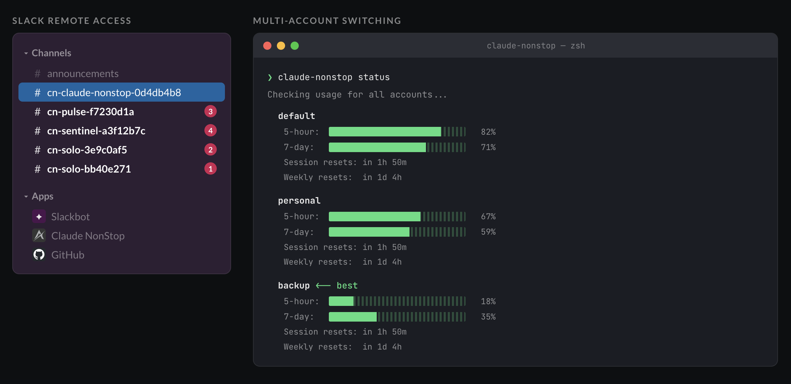

# claude-nonstop

[](LICENSE)
[](https://nodejs.org/)

Multi-account switching + Slack remote access for Claude Code.

**Multi-account switching:** When you hit a rate limit mid-session, claude-nonstop kills the idle process, migrates your session to a different account, and resumes — fully automated, zero downtime.

**Slack remote access:** Each Claude Code session gets a dedicated Slack channel. Send messages in the channel to control Claude remotely. Claude's responses are posted back to the channel.



> **Platform:** Tested on macOS only. Linux may work but is untested.

[Contributing](CONTRIBUTING.md) | [Security Policy](SECURITY.md) | [Architecture](DESIGN.md)

## Usage

```bash
claude-nonstop                       # Run Claude (best account, auto-switching)
claude-nonstop -p "fix the bug"      # One-shot prompt
claude-nonstop status                # Show usage across all accounts
claude-nonstop --remote-access       # Run with tmux + Slack channels
```

Sample `status` output:

```
  default (alice@gmail.com)
    5-hour:  ███░░░░░░░░░░░░░░░░░ 14%
    7-day:   ██████░░░░░░░░░░░░░░ 29%

  work (alice@company.com) <-- best
    5-hour:  █░░░░░░░░░░░░░░░░░░░ 3%
    7-day:   ██░░░░░░░░░░░░░░░░░░ 8%
```

On launch, claude-nonstop checks usage across all accounts and picks the one with the most headroom. If you hit a rate limit mid-session, it automatically switches to the next best account and resumes your conversation.

## Commands

**Core:**

| Command | Description |
|---------|-------------|
| `status` | Show usage with progress bars and reset times |
| `add <name>` | Add a new Claude account (opens browser for OAuth) |
| `remove <name>` | Remove an account |
| `list` | List accounts with auth status |
| `reauth` | Re-authenticate expired accounts |
| `resume [id]` | Resume most recent session, or a specific one by ID |

**Slack remote access:**

| Command | Description |
|---------|-------------|
| `setup` | Configure Slack tokens + install hooks (run `setup --help` for flags) |
| `webhook status` | Show webhook service status |
| `webhook install` | Install webhook as launchd service (macOS) |
| `webhook logs` | Tail the webhook log |
| `hooks install` | Install hooks into all profiles |
| `hooks status` | Show hook installation status |

**Maintenance:**

| Command | Description |
|---------|-------------|
| `update` | Reinstall from local source |
| `uninstall` | Remove claude-nonstop completely |

Any unrecognized arguments are passed through to `claude` directly. Use `-a <name>` to select a specific account.

## Install

The easiest way to install is to ask Claude Code:

```
You: set up claude-nonstop for me
```

Claude Code will follow the [setup instructions in CLAUDE.md](CLAUDE.md#setting-up-claude-nonstop-for-a-user) to install, configure accounts, and set up Slack remote access interactively. That file also serves as a reference for AI agents automating the setup.

### Manual install

**Prerequisites:** Node.js 22+ ([download](https://nodejs.org/)), C/C++ build tools (`xcode-select --install` on macOS), Claude Code CLI ([install](https://docs.anthropic.com/en/docs/claude-code/overview)), and tmux for remote access.

```bash
git clone https://github.com/rchaz/claude-nonstop.git
cd claude-nonstop
npm install -g "$(npm pack)"
claude-nonstop help
```

If `npm install -g` fails with compilation errors, you're missing C/C++ build tools.

## Multi-Account Setup

Your existing `~/.claude` account is auto-detected as "default". Verify with `claude-nonstop list`.

Add additional accounts (each must be a different Claude subscription). Names can contain letters, numbers, hyphens, and underscores:

```bash
claude-nonstop add work
claude-nonstop add personal
```

Each `add` opens your browser for OAuth. After login, claude-nonstop checks for duplicate accounts (same email) and removes them automatically.

Verify all accounts are working:

```bash
claude-nonstop status
```

Then just run `claude-nonstop` — rate limit switching is automatic.

**Troubleshooting:**
- OAuth didn't complete? Run `claude-nonstop reauth`
- Status shows `error (HTTP 401)`? Run `claude-nonstop reauth`
- "No credentials found"? Run `CLAUDE_CONFIG_DIR="$HOME/.claude-nonstop/profiles/<name>" claude auth login`

**Optional aliases** (`~/.zshrc` or `~/.bashrc`):

```bash
alias claude='claude-nonstop'
alias cn='claude-nonstop --dangerously-skip-permissions'
```

## Slack Remote Access

### 1. Create a Slack App

Go to [api.slack.com/apps](https://api.slack.com/apps) > **Create New App** > **From a manifest**. Paste [`slack-manifest.yaml`](slack-manifest.yaml), click **Create**, then **Install to Workspace**.

<details>
<summary>Manual setup (without manifest)</summary>

Create a new app at [api.slack.com/apps](https://api.slack.com/apps). Enable Socket Mode (Settings > Socket Mode). Add bot token scopes: `chat:write`, `channels:manage`, `channels:history`, `channels:read`, `reactions:read`, `reactions:write`, `app_mentions:read`, `im:history`, `im:read`, `im:write`. Subscribe to bot events: `message.channels`, `message.im`, `app_mention`. Install to workspace.
</details>

**Collect two tokens:**

1. **Bot Token** (`xoxb-...`) — OAuth & Permissions page (created on install)
2. **App Token** (`xapp-...`) — Basic Information > App-Level Tokens > **Generate Token and Scopes** > add `connections:write` scope > Generate

### 2. Run setup

```bash
claude-nonstop setup --bot-token xoxb-... --app-token xapp-... --invite-user-id U12345ABCDE
```

This writes `~/.claude-nonstop/.env`, installs hooks, and starts the webhook service (macOS). Run `setup --help` for all flags. For interactive setup, just run `claude-nonstop setup`.

Find your Slack User ID: click your profile picture > Profile > three-dot menu > Copy member ID.

### 3. Verify

```bash
claude-nonstop webhook status    # Should show "running" with a PID
claude-nonstop hooks status      # All should show "installed"
```

### 4. Run with remote access

```bash
claude-nonstop --remote-access
```

This creates a tmux session named after the current directory, enables `--dangerously-skip-permissions` for unattended operation, and sets `CLAUDE_REMOTE_ACCESS=true` so each session gets a dedicated Slack channel (e.g., `#cn-myproject-abc12345`). Reply in the channel to send messages to Claude.

**Control commands** in session channels:

| Command | Action |
|---------|--------|
| `!stop` | Interrupt Claude (Ctrl+C) |
| `!status` | Show current terminal output |
| `!cmd <text>` | Relay text verbatim (e.g. `!cmd /clear`) |
| `!help` | List available commands |
| `!archive` | Archive the channel |

**Note:** Slack message relay sends keystrokes to tmux. Claude must be waiting for input to receive messages. If Claude is mid-processing, keystrokes queue and are delivered when Claude next waits.

**Security:** `--remote-access` implies `--dangerously-skip-permissions`, giving Claude full system access. Use `SLACK_ALLOWED_USERS` to restrict who can send commands via Slack.

**Troubleshooting:**
- Channel not created? Run `claude-nonstop hooks install` then `hooks status`
- Webhook not receiving? Run `claude-nonstop webhook status` then `webhook logs`
- Messages not reaching Claude? Check `tmux ls` and that Claude is waiting for input

## How It Works

**Multi-account switching** queries the Anthropic usage API for all accounts (~200ms), picks the one with the most headroom, then monitors Claude's output for rate limit messages in real-time. On detection: kill, migrate session files to the next account, resume with `claude --resume`.

**Slack remote access** uses Claude Code [hooks](https://docs.anthropic.com/en/docs/claude-code/hooks) — `SessionStart` creates a Slack channel, `Stop` posts a completion summary. A separate webhook process connects via Slack Socket Mode and relays channel messages to tmux. The runner scrapes PTY output for tool activity and posts progress updates to Slack every ~10 seconds.

## Architecture

```
claude-nonstop/
├── bin/claude-nonstop.js         CLI entry point and command routing
├── lib/                          Core logic (ESM)
│   ├── config.js                 Account registry
│   ├── keychain.js               OS credential store reading
│   ├── usage.js                  Anthropic usage API client
│   ├── scorer.js                 Best-account selection
│   ├── session.js                Session file migration
│   ├── runner.js                 Process wrapper + rate limit detection
│   ├── service.js                launchd service management (macOS)
│   ├── tmux.js                   tmux session management
│   ├── reauth.js                 Re-authentication flow
│   └── platform.js               OS detection
├── remote/                       Slack remote access subsystem (CJS)
│   ├── hook-notify.cjs           Hook entry point
│   ├── channel-manager.cjs       Slack channel lifecycle
│   ├── webhook.cjs               Socket Mode handler (Slack -> tmux)
│   ├── start-webhook.cjs         Webhook process entry point
│   ├── load-env.cjs              Environment file loader
│   └── paths.cjs                 Shared path constants
└── scripts/postinstall.js        Restart webhook on npm install
```

User data lives under `~/.claude-nonstop/` (config, `.env`, profiles, logs). See [DESIGN.md](DESIGN.md) for details.

## Troubleshooting

### `npm install` fails with compilation errors

`node-pty` requires C/C++ build tools: `xcode-select --install` (macOS), then re-run `npm install`.

### Usage shows "error (HTTP 401)"

OAuth token expired. Run `claude-nonstop reauth` to refresh all expired accounts.

### Webhook not receiving messages

Check `claude-nonstop webhook status` and `webhook logs`. Verify Socket Mode is enabled and bot events (`message.channels`, `message.im`) are subscribed in your Slack app settings.

### Messages not reaching Claude

Claude must be waiting for input. Check `tmux ls` and `~/.claude-nonstop/data/channel-map.json`.

## Platform Support

| Platform | Credential Store | Service Management | Status |
|----------|-----------------|-------------------|--------|
| macOS | Keychain (`security`) | launchd | Tested |
| Linux | Secret Service (`secret-tool`) | Manual (systemd) | Untested |
| Windows | — | — | Not supported |

## License

[MIT](LICENSE)
